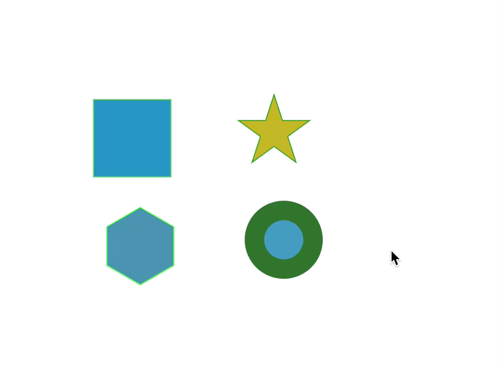
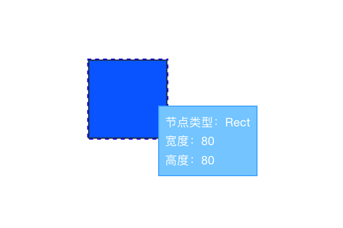

<!--
 * @Author: zi.yang
 * @Date: 2023-08-01 21:53:46
 * @LastEditors: zi.yang
 * @LastEditTime: 2023-08-05 23:19:45
 * @Description: README
 * @FilePath: /leafer-tooltip-plugin/README.md
-->

# Leafer Tooltip Plugin

Tooltip 插件主要用于 Leafer 元素/节点上 展示一些自定义信息。

使用 Tooltip 插件后，当鼠标悬浮在元素上时，会显示一个弹框展示节点的详细信息。

> 注意：该插件强依赖 leafer-ui@1.0.0-beta.8 版本及以上

# 快速上手

## 安装

```shell
npm i leafer-tooltip-plugin --save
```

## 使用方法

使用插件时，传入 `getContent` 参数，并返回需要展示的内容即可

```js
import { plugin } from 'leafer-tooltip-plugin';

usePlugin(plugin, {
  getContent(node) {
    const dom = `<ul style="list-style: none; margin: 0; padding: 0">
      <li>节点类型：${node.tag}</li>
      <li>宽度：${node.width}</li>
      <li>高度：${node.height}</li>
    </ul>
    `;
    return dom;
  },
});
```

### 效果演示


## 允许限制指定的元素类型

传入 `includeTypes` 参数，限制允许显示提示框的类型

```js
import { plugin } from 'leafer-tooltip-plugin';

usePlugin(plugin, {
  includeTypes: ['Ellipse'],
  getContent(node) {
    const dom = `<ul style="list-style: none; margin: 0; padding: 0">
      <li>节点类型：${node.tag}</li>
      <li>宽度：${node.width}</li>
      <li>高度：${node.height}</li>
    </ul>
    `;
    return dom;
  },
});
```

### 效果演示



## 允许自定义容器类样式

默认情况下，插件会对所有 leafer 实例生效。  
有时我们只需要指定的实例生效，这时我们可以自定义注册类型。

声明注册类型后，需要将 leafer 实例类型指定为该类型

```js
import { plugin } from 'leafer-tooltip-plugin';

usePlugin(plugin, {
  // 指定注册类型
  className: 'my-tooltip-plugin',
  getContent(node) {
    const dom = `<ul style="list-style: none; margin: 0; padding: 0">
      <li>节点类型：${node.tag}</li>
      <li>宽度：${node.width}</li>
      <li>高度：${node.height}</li>
    </ul>
    `;
    return dom;
  },
});
```

css 中添加自定义的类样式

```css
.my-custom-tooltip{
  border: 1px solid rgba(0, 157, 255, .62);
  padding: 6px;
  background-color: rgb(131, 207, 255);
  color: #fff;
  font-size: 12px;
  font-weight: 400;
}
```

### 效果演示



## 允许只对指定注册类型的 leafer 生效

默认情况下，插件会对所有 leafer 实例生效。  
有时我们只需要指定的实例生效，这时我们可以自定义注册类型。

声明注册类型后，需要将 leafer 实例类型指定为该类型

type 参数介绍：

- 当 type 为布尔类型时：
  - `type === true`：注册类型默认为 `tooltip-plugin`
  - `type === false`：全局生效，不进行注册类型
- 当 type 为字符串时：注册类型为用户传入的类型

```js
import { plugin } from 'leafer-tooltip-plugin';

usePlugin(plugin, {
  // 指定注册类型
  type: 'my-tooltip-plugin',
  getContent(node) {
    const dom = `<ul style="list-style: none; margin: 0; padding: 0">
      <li>节点类型：${node.tag}</li>
      <li>宽度：${node.width}</li>
      <li>高度：${node.height}</li>
    </ul>
    `;
    return dom;
  },
});


// leafer 实例指定 my-tooltip-plugin 类型才能生效
const leafer = new Leafer({
  view: window,
  type: 'my-tooltip-plugin' // 指定插件类型
})
```

# 属性列表

| 属性         | 类型 | 说明                     | 默认值｜ |
| ------------ | ---- | ------------------------ | -------- |
| type   | `布尔值 | 字符串`  | 自定义注册类型，如果为 `true`, 则默认为 'tooltip-plugin'，如果为空，或者为 false, 则为所有 leafer 注册               | -        |
| className   | `字符串` | 自定义容器类样式               | -        |
| includeTypes | `数组` | 允许展示提示框的类型列表 | 所有类型 |
| getContent   | `函数` | 显示的内容               | -        |
